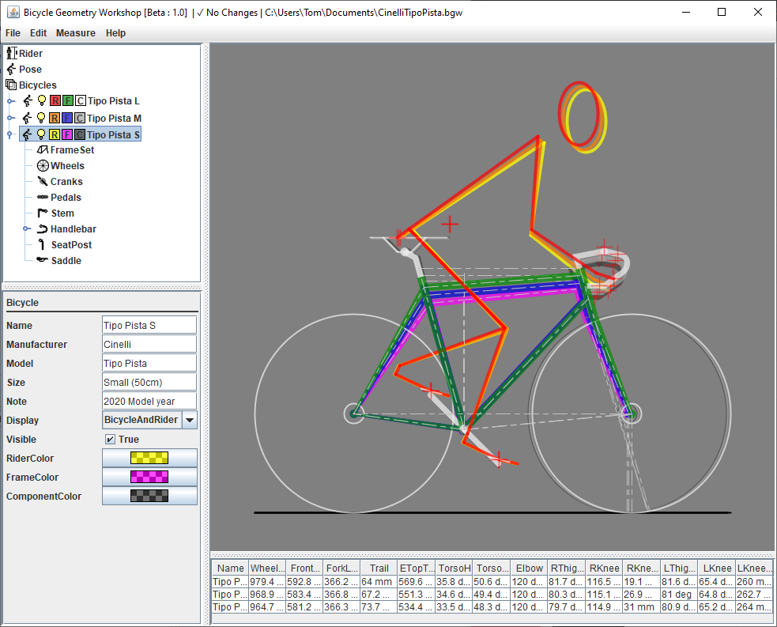

# Bicycle Geometry Workshop#

## A Bicycle Geometry Calculator for Java ##

Welcome to the The Bicycle Geometry Workshop.  This application was designed to 
help in analyzing the bicycle and rider geometry relationship.  
The workshop allows for comparing frames, complete bicycles, and the rider position in relation.

## Notes ##
Please refer to the included help files and javadocs for further information (dist folder).

### License ###
Released under the MIT License, 2020.

